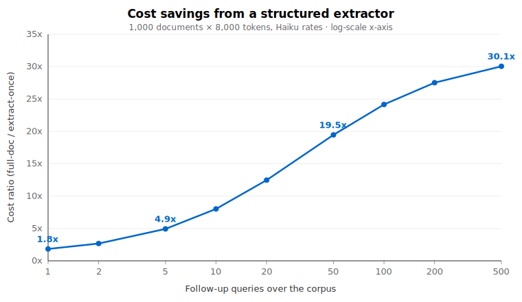

# model-cost-advisor

A Claude skill that nudges you toward cheaper, faster ways to do the same work — without blocking the task. It catches two common money-burners:

1. **Tier overkill.** Running Opus on a task Haiku could handle.
2. **Context bloat.** Pulling whole source documents into context because no structured extractor exists in the repo — the silent killer of token budgets.

The second is the bigger lever. With current Anthropic pricing, switching from Opus to Haiku is at most a 5x win. Switching from "load full documents every query" to "extract once, query the table" compounds with usage and overtakes tier savings within ~20 follow-up queries.

## Why this exists

Most Claude cost-advice tools focus on model tier. That made sense when Opus was 15x Haiku. As of May 2026 it's 5x — still meaningful, but the bigger lever is now context shape. This skill bakes both into a single decision rule and ships with a harness that measures the math.

## How it works

**The skill is a piece of text. The harness is a measuring tape.** Concretely:

- **`SKILL.md`** is the product. It's a markdown file Claude reads on every request. The frontmatter tells Claude *when* to trigger; the body tells Claude *what* to nudge about (tier overkill or context bloat) and *how* (one short line, then do the work anyway). You don't run it — Claude does, automatically, once the file is in your skills folder.
- **`harness/`** is the toolkit you use to verify the skill's claims. It doesn't run as part of the skill; it exists so anyone reviewing the repo can reproduce the numbers.
  - `run_harness.py` — runs the eval cases across Haiku/Sonnet/Opus and records real tokens.
  - `failure_mode_test.py` — fails the build if the cost gap claim collapses or the skill text loses the failure-pattern language.
  - `estimate.py` — standalone cost calculator, no skill required.
  - `run_benchmark.py` — produces the public `BENCHMARK.md` report.
  - `generate_chart.py` — produces the SVG embedded above.
- **CI** runs the regression on every PR so the claims in this README stay true as the codebase evolves.

## The numbers



Corpus of 1,000 documents × 8,000 tokens each, running on Haiku:

| Follow-up queries | Full-doc path | Extract-once path | Savings |
|---:|---:|---:|---:|
| 5  | $48    | $10  | 4.9x |
| 50 | $409   | $21  | 19.5x |
| 500| $4,013 | $133 | 30.1x |

Reproduce with `python harness/failure_mode_test.py`. For a full live benchmark (real API calls), see [`BENCHMARK.md`](BENCHMARK.md) (generated by `python harness/run_benchmark.py`).

## Quick: estimate any prompt's cost without installing the skill

```bash
python harness/estimate.py "Summarize this email: ..."
python harness/estimate.py --input-tokens 50000 --output-tokens 2000
python harness/estimate.py "..." --cache-hit-ratio 0.8 --batch
python harness/estimate.py "..." --volume 10000
```

No API key required — uses an offline token estimate. Cache and batch flags model the same multipliers Anthropic publishes (cache hits 0.1x base input, Batch API 50% off both directions). Stack them on top of tier choice.

## Install

Drop `SKILL.md` into your Claude skills folder:

```bash
cp SKILL.md ~/.claude/skills/model-cost-advisor/SKILL.md

# Or clone the repo into the skills folder directly
git clone https://github.com/<your-github-handle>/model-cost-advisor.git \
  ~/.claude/skills/model-cost-advisor
```

Claude will pick it up automatically and trigger on tasks that match the description.

## How it nudges

**Tier nudge — when a task looks routine:**
> This looks like a task a cheaper tier (e.g. Haiku/Sonnet) would handle just as well — you could switch to save cost. Happy to proceed here either way:

**Context-bloat nudge — when the plan loads whole documents because no extractor exists:**
> Before running this, a heads-up: pulling all the source documents into context every time will dominate your token spend — likely more than model choice does. If the repo doesn't already have a structured extractor or index, it's worth building one (parse the fields you actually need once, then have me query the table). Want me to scope that, or proceed with full-document loading for now?

Either way, Claude completes the task.

## What the skill won't do
- Refuse or delay work waiting for a decision.
- Nudge repeatedly in the same conversation.
- Nudge for genuinely complex tasks (deep reasoning, hard debugging, novel research, nuanced writing).
- Invent pricing — it asks Claude to verify rates with the product docs before quoting specifics.

## Harness

```bash
cd harness
pip install -r requirements.txt

# Offline — no API key needed
python failure_mode_test.py
python run_harness.py --dry-run

# Live — measure real token counts across tiers
export ANTHROPIC_API_KEY=sk-ant-...
python run_harness.py --runs 3
```

See [`harness/README.md`](harness/README.md) for full operator details.

## CI

[`.github/workflows/skill-ci.yml`](.github/workflows/skill-ci.yml) runs the regression test and a dry-run sweep on every PR. No API key required for CI — the failure-mode check is structural + math, not live API calls.

## Contributing

PRs welcome — see [CONTRIBUTING.md](CONTRIBUTING.md) for fork/attribution norms, the PR checklist, and what kind of changes land. TL;DR: keep `failure_mode_test.py` green, update `prices.json` (with a verification date) if pricing shifts, and prefer Issues for anything that restructures scope.

## Contact

- **Bug reports + feature requests:** [open a GitHub Issue](https://github.com/<your-github-handle>/model-cost-advisor/issues).
- **Reaching the author:** [@&lt;your-github-handle&gt;](https://github.com/<your-github-handle>) on GitHub.
- **Want to share how you're using it?** Discussions tab is open.

*(Replace `<your-github-handle>` with your GitHub username once the repo is up.)*

## License

[MIT](LICENSE). Use it, fork it, ship it.
